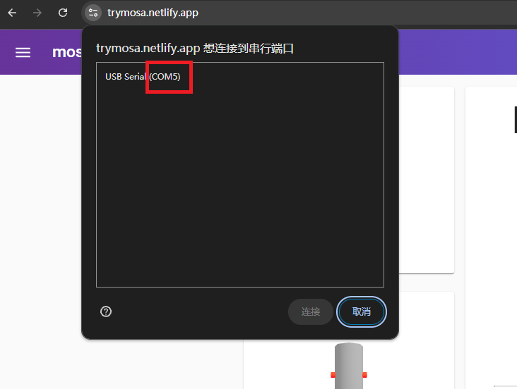

# OSR-VRChat

[English Version]()

一个OSR机器人的驱动程序，实现了OSR机器人与VRChat的动作同步。

非常感谢[Shocking-VRChat](https://github.com/VRChatNext/Shocking-VRChat)郊狼项目搭建的框架！

测试QQ群：1034983762

## 使用方法

### 准备工作

1. 确保攻方的牛牛和受方的插座**都是基于SPS制作的**（**不支持DPS/TPS**，因为这两个插件缺少用于计算深度的OGB数据接口）

2. 连接OSR2到电脑，打开OSR2的开关，**Chrome**浏览器打开[Mosa控制器](https://trymosa.netlify.app/)网页，左上角选择Serial并在弹窗中选择对应的串口

- 如图所示，请记住红框中的串口名字（通常是`COM`+一个数字）。拖动控制轴，确保OSR设备工作正常，测试完必须**关闭网页**以解除串口占用

3. 确认VRChat中开启了OSC数据接口，确认模型的吸附功能已开启

### 参数设置
`objective`：动作目标，下表为所有允许的取值及解释：

| `objective` | 解释                        |
|-----------|-----------------------------|
| `inserting_self`      | 使用自己的插头插入别人的插座 |
| `inserting_others`    | 使用自己的插头插入自己的插座（例如插自己的手，通常用作测试）   |
| `inserted_ass`      | 自己位于肛门的插座被别人插入   |
| `inserted_pussy`     | 自己位于小穴的插座被别人插入  |

请根据自己的使用情况，在设置文件填入对应的值

\
`com_port`：设备连接的串口，填入准备工作中记住的串口号（例如`COM5`）

OSR2的总移动范围为**999**个单位（和Mosa中一样）

`max_position`：移动位置上限，范围0-999

`min_position`：移动位置下限，范围0-999

`max_velocity`：速度上限（单位/秒），范围0-999

`updates_per_second`：每秒更新次数，范围0-100

### 运行程序

1. 下载Releases中的osr_vrchat.exe，运行程序，第一次运行会生成设置文件并自动退出
2. 完成上面的流程，进行设备检查并正确设置参数
3. 再次运行程序，即可与VRChat同步。如果更改了参数，需要重启程序才能生效

## Q&A

### 1. 什么是OSR？

OSR是**O**pen-source **S**troker **R**obot的缩写，意思是开源飞机杯机器人。目前此项目仅支持OSR2/2+，是OSR系列中最便携小巧的型号，支持2/3轴上的运动。未来将陆续更新对OSR6以及其他更复杂的机器人的支持。更多信息可以参考[此网页](https://discuss.eroscripts.com/t/guide-what-is-the-osr2-sr6-ssr1-and-how-do-i-get-one/158805)。

### 2. 如何获取OSR2设备？

在闲鱼上有很多买成品设备和固定支架的商家，价格通常和舵机质量/扭矩以及包含的附件有关，可以根据自己的需求以及预算进行购买。如果想自己搭建OSR2系统，请参考[此项目](https://www.patreon.com/tempestvr)。

### 3. 什么是OGB？

[OGB](https://osc.toys/)项目的全名是Osc Goes Brrr，实现了游戏中SPS插入动作和支持[Intiface](https://intiface.com/)的玩具的同步。OGB的作者Senky也是SPS系统的作者，在SPS插件中预留了一系列地址为`/avatar/parameters/OGB/*`的OSC数据接口，大大方便了深度的计算。

## 更新计划
三月份将会推出可穿戴的方案，支持各种体位，敬请期待。